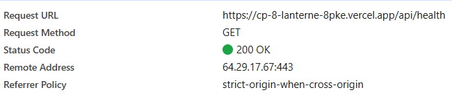
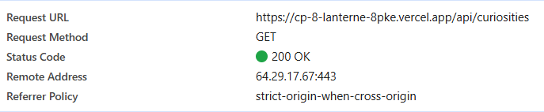
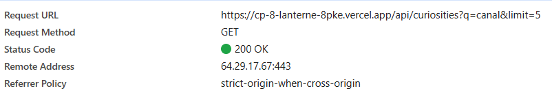
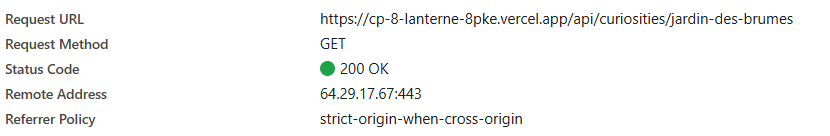

### Requêtes exécutées


## 4 Vérifier l'API déployée

Après avoir effectué le test de `/api/health` j'ai obtenu :
```
{
  "status": "ok",
  "environment": "development",
  "version": "1.0.0"
}

```
le statut reçu est `200` donc il est bon.



Le test de `/api/curiosities` me renvoie bien le JSON attendu.

le statut reçu est `200` donc il est bon.



Pour le test de `/api/curiosities?q=canal&limit=5` il me renvoie également ce qui est attendu : 

```
{
  "data": [
    {
      "slug": "passage-bleu",
      "title": "Le passage bleu",
      "city": "Nantes",
      "category": "architecture",
      "description": "Une galerie discrète au bord du canal, reconnaissable à ses carreaux bleus."
    }
  ],
  "meta": {
    "count": 1,
    "limit": 5,
    "query": "canal",
    "category": ""
  }
}
```
le statut reçu est `200` donc il est bon.




Pour le dernier test `/api/curiosities/:slug` j'ai remplacer `:slug` par `jardin-des-brumes` et j'ai bien obtenu le résultat attendu :

```
{
  "data": {
    "slug": "jardin-des-brumes",
    "title": "Le jardin des brumes",
    "city": "Nantes",
    "category": "nature",
    "description": "Un jardin partagé où les aromatiques sont entretenues avant l’ouverture des bureaux."
  }
}
```
le statut reçu est `200` donc il est bon.



Toutes les méthodes HTTP on était réalisées avec `GET`.